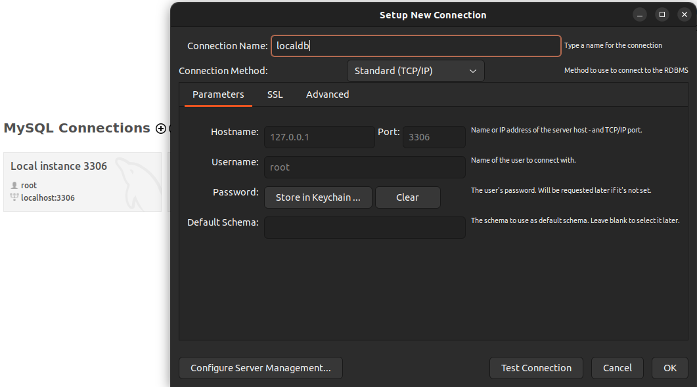
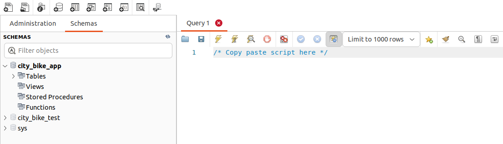

# Helsinki bike API

This project is part of my submission to [Solita dev academy 2023](https://github.com/solita/dev-academy-2023-exercise). It consists of a backend service to provide Helsinki and Espoo's city bike stations data, as well as data of journeys taken in the summer of 2021.
The application was built using Java and the [Spring framework](https://spring.io/).

The reason I chose Java is that, as of right now, it is the language I have the most experience on, and I am quite comfortable developing in this language. Spring's ecosystem also took an important role in the decision, as it is extremely flexible, and it met all my needs: from building a web application to running jobs to import and validate the stations and journeys data.  

**_NOTE:_** As of 20/06/2023 the application will not be hosted on the cloud for a while. This was caused by changes on the pricing of my backend provider,
however it should be back online soon.

## API Reference

#### Get all stations

```http
  GET /api/v1/stations
```

| Parameter | Type     | Description                | Default |
| :-------- |:---------| :------------------------- | :-------|
| `pageNo` | `int`    | **Optional**. Page number | `0`|
| `pageSize` | `int`    | **Optional**. Number of elements to be displayed | `15`|
| `sortBy` | `string` | **Optional**. Field used for sorting | `nimi`|
| `sortDir` | `string` | **Optional**. Sort direction | `asc`|

#### Get a station by its id

```http
  GET /api/v1/station?id={id}
```

| Parameter | Type  | Description                       |
| :-------- |:------| :-------------------------------- |
| `id`      | `int` | **Required**. Id of station to fetch |

#### Get all journeys

```http
  GET /api/v1/journeys
```

| Parameter | Type     | Description                | Default |
| :-------- |:---------| :------------------------- | :-------|
| `pageNo` | `int`    | **Optional**. Page number | `0`|
| `pageSize` | `int`    | **Optional**. Number of elements to be displayed | `15`|
| `sortBy` | `string` | **Optional**. Field used for sorting | `departureDate`|
| `sortDir` | `string` | **Optional**. Sort direction | `asc`|


## Prerequisites
- Java 17
- Docker and docker compose plugin
- Maven 3.5+
## Configuration
As the backend service fetches data from a database, you will need to set up a database and update the application properties file.

### Setting up the database

Clone the project

```bash
  git clone https://github.com/SRH8/hel-bike-api.git
```

Setting up the database is fairly simple thanks to docker. All you need to do is run the following command in the project's root directory

```bash
  docker compose up
```
This will start a MySQL database container.

### Importing the data
Now that you have the database up and running it is time to add data to it. There are two ways to go about this:
- Importing data through a sql file (for a simpler way)
- Using the [data import utility](https://github.com/SRH8/hel-bike-data-import) (Recommended)

If you decide to use the [data import utility](https://github.com/SRH8/hel-bike-data-import), you will find instructions on how to use it in its repository.
If you decide not to use it, keep reading for step-by-step instructions on how to import the data using a sql file.

- Download [this file](https://drive.google.com/file/d/1pmMXprGnx53urOSJT-y1jIdg1OpFT4Bk/view?usp=drive_link). It contains the sql script that will be used to import the data
- Download a MySQL client to import the data. I will be using MySQL Workbench, but you can use any other client

- Create a new connection and log in to the database. You can use root as username and password
<p align="center">
  
  </p>

- Paste the contents of the file in the editor and run the script using the thunder button
<p align="center">
  
  </p>
  
After you run the script, you are ready to run the backend service locally. 
## Run Locally
Once you have cloned the project, set up the database and added data to it, you can run the backend service by following this guide.

Go to the project directory. Maven will install all necessary dependencies to run the project.

```bash
  cd hel-bike-api
```

Edit application.properties file to set up the local datasource
```
spring.datasource.url=jdbc:mysql://localhost:3306/city_bike_app
spring.datasource.username=root
spring.datasource.password=root
spring.jpa.hibernate.ddl-auto=validate
spring.jpa.show-sql=true
server.error.include-message=always
```

Start the service

```bash
  ./mvnw spring-boot:run
```


## Running Tests

To run tests, run the following command

```bash
  ./mvnw clean test
```


## Licenses
Station data is owned by [Helsinki Region Transport’s (HSL)](https://www.avoindata.fi/data/en_GB/dataset/hsl-n-kaupunkipyoraasemat/resource/a23eef3a-cc40-4608-8aa2-c730d17e8902?inner_span=True)

Journeys data is owned by [City Bike Finland](https://www.citybikefinland.fi/)